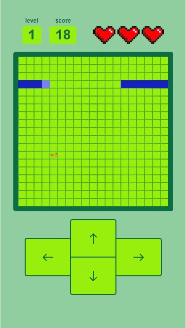
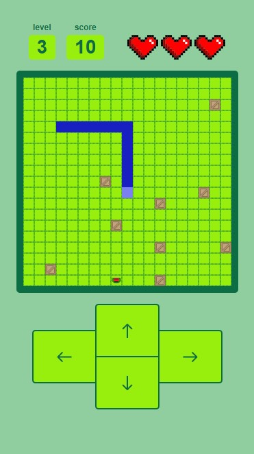
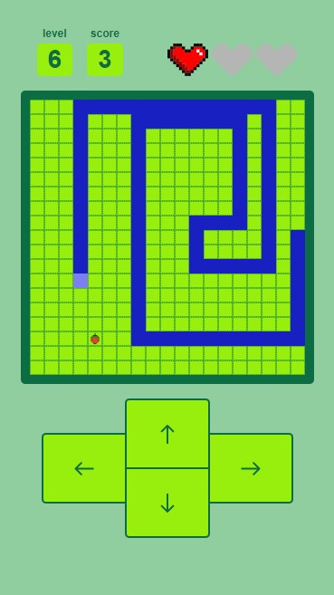
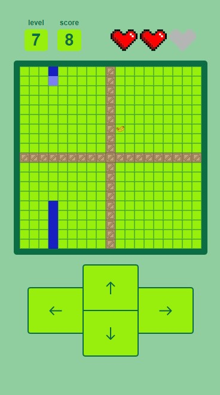
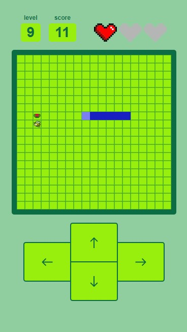
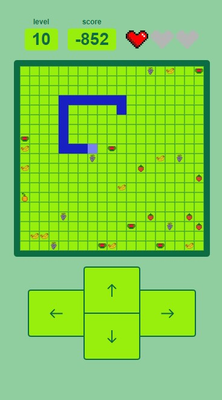
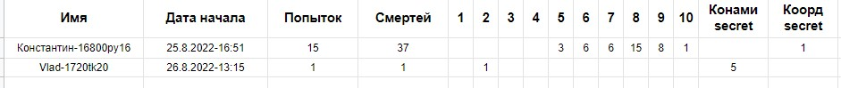

## [Играть](https://cyberqostya.github.io/snakegame/)  
ЗМЕЙ-К - мой первый геймдев проект. Всегда мечтал создать свою игру, но поскольку концепт змейки уже существовал, я воспользовался уже созданной интеллектуальной собственностью и
добавил свои супер-пупер-мега-клевые модификации к игре. От уровня к уровню игрок самостоятельно, наощупь, изучает, что какое изменение его ждет.

Вся игра построена на идее адаптации к неизвестному. Игроку, по возможности, ничего не сообщается, он самостоятельно изучает игру. Так например он сам должен понять, сколько ему осталось съесть фруктов до победы, так как уменьшается счетчик score, может ли он проходить сквозь стены или кусать себя за хвост. Все ровно как в биологии, жизни. Но разработчик (я) побуждаю в игроке думательные функции. Не просто так змейка на старте появляется у границы карты: ведь если игрок не успеет повернуть, то змея пойдет в стену и появится с противоположной стороны, тем самым игрок поймет, что стены - безопасные.

Много условий в компоненте игры, но при это я гибко могу совмещать модификации уровней между собой.

## Уровни
### 1. Обычная змейка, но границы карты телепортируют тебя на противоположную сторону карты
Игроку предлагается вспомнить геймплей олдовой игры, приспособиться к элементам управления, звукам интерфейса итд.
 
 

### 2. Случайная скорость змейки при поедании фрукта
Этот уровень развлекает терпение и чувство таймингов у игрока, ведь скорость варьируется от очень низкой до очень высокой. Сложность уровня заключается в том, что количество фруктов, которое должна съесть змейка больше на 7 чем количество клеток карты (карта квадратная). Что это значит? Когда длина змейки меньше либо равна ширине/высоте карты, она с легкостью проходит сквозь стены и не дотягивается до своего хвоста (если змейка будет двигаться строго в горизонтальном или вертикальм направлении). Но проблемы начинаются как раз на последних 7 фруктах, когда длина змеи больше ширины/высоты уровня и игрок должен всегда маневрировать своей подопечной, чтобы избежать столкновения с самим собой. А если еще и выпадет высокая скорость...

### 3. Съеденные фрукты превращаются в препятствия
Название уровня говорит само за себя
 
 

### 4. Обычная змейка, но теперь границы стали стенами
Здесь происходит уловка игрока, поскольку в предыдущих трех уровнях стены были безопасной механикой, к которой уже привыкли, а теперь это препятствия.

### 5. Управление змейкой инвертировано и границы карты - препятствия
И в этом уровне происходит уловка. Вроде ничего не поменялось, нет препятствий, а стрелки управления поменяли свои свойства.

### 6. Съеденная ягода увеличивает длину змеи вдвое и границы карты - препятствия
Изначально длина змейки - 3 клетки. Чтобы победить в этом уровне игрок должен съесть 8 фруктов. Соответственно 3 * 2^8 = 768, что больше количества клеток на карте 19*19 = 361. По задумке разработчика (моей) игрок должен передвигаться таким образом, чтобы занять все место на карте, чтобы новый фрукт не появился в недоступном телом змеи месте. Вдохновился этим уровнемкогда посмотрел прохождение оригинальной змейки, где игрок двигался строго зигзагами. Границы здесь создают дополнительную сложность.
 
 

### 7. Препятствие в форме креста
Этот уровень представлен в виде вывернутого обычной карты наизнанку. Теперь границы не по бокам, а в центре и змейка все также может перемещаться во все области карты. Уловка этого уровня заключается в том, что игрок привык, что границы карты - препятствия, но теперь они опять дают возможность перемещаться на противоположную строну.
 
 

### 8. Фрукты появляются по таймеру и при наличии 7 несъеденных змейка умирает и границы карты - препятствия
Здесь увеличена скорость змейки, которая добавляет сложность, но помогает не залеживаться фруктам на карте.

### 9. Пчела
Теперь фрукты охраняет пчела, которая летает вокруг. При столкновении с ней змейка, очевидно, умирает. Границы кстати разблокированы и не являются препятствиями.
 
 

### 10. Съеденный фрукт имеет свою стоимость и границы карты - препятствия
До этого уровня не имело значения какой фрукт съела змея. Разработчик отрисовал 5 разных типов фруктов: клубника, арбуз, абрикос, виноград и банан. Теперь банан +4 очка, абрикос *2 очков, клубника меняет знак и так далее. Игрок должен сам понять какой фрукт какой количество очков дает. А также, все уровни до этого показывали, чтобы выиграть, нужно свести количество очков до 0. Здесь такая же ситуция, но начальное количество очков - 100 (сразу оказывает плохой психологический эффект). Фрукты появляются по таймеру и могут заполонить всю карту.
 
 

## Оформление:
Каждому действию сопутствует звуковое сопровождение: змейка врезалась, съела фрукт, пройден уровень итд.
После прохождения кждого уровня на экране появляется цитата, посвещенная адаптации в жизни - ведь это основная идея проекта. А также после прохождения шестого (специально не написал цифрой) уровня появляется подсказка, воспользовавшись которой игрок будет иметь преимущество в будущих прохождениях (дополнительную жизнь). Вдруг кто-то не читает тексты игры...

## Отслеживание прогресса игроков
С помощью GoogleSheetsAPI была создана таблица, в которую приходили даные от игры. Разработчику необходимо было отслеживать:
* имя игрока
* дату начала, 
* количество попыток (количество заново начавшихся игр)
* количество смертей змейки
* на какм уровне змейка умерла
* нашел ли игрок секрет с доп жизнью 1
* нашел ли игрок секрет с доп жизнью 2
Имя имеет дополнительную приставку в виде зашифрованного кода. Это сделано умышленно, поскольку разработчик проводил конкурс на прохождение игры среди своих друзей и победителям вручал призы. Чтобы избежать мошенников был придуман этот код.
 
 

## Будущие идеи:
1. Сделать уровни случайными при очередной попытке пройти игру
1. Выбор уровня сложности
1. Постановка на паузу игры
1. Новые уровни

## Что извлек из ошибок/сложностей:
1. Логику уровней нужно разделять, а не писать логику всей игры в одном файле game.js с множеством условий.
1. Когда что-то зависит от чего-то, это нужно записовать в notes.txt: почему эта функция должна обязательно вызываться после этой